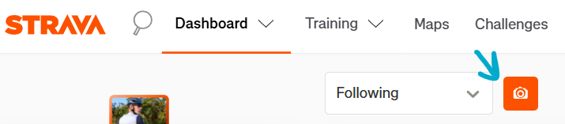

# Strava Hide Posts Without Photos

A lightweight Tampermonkey / Userscript that adds filter buttons to your Strava Dashboard.
Hide feed posts without photos and/or virtual activities (Zwift, indoor trainers, etc.) with a single click.

---

## Screenshot

---

## Features

- **Photo filter** — hides all posts without photos (camera icon 📷)
- **Virtual filter** — hides virtual activities like Zwift, indoor rides, etc. (monitor icon 🖥️)
- Both filters work **independently** — enable one, both, or none
- **Hidden posts counter** — each button shows a red badge with the number of hidden posts
- **Persistent state** — remembers your filter settings after page reloads
- **Performance optimized** — debounced DOM observation scoped to the feed container
- Works with **infinite scroll** and dynamically loaded feed items

---

## Installation

1. Install [Tampermonkey](https://www.tampermonkey.net/)
2. Click to install the userscript: [**Install Strava Photo Filter**](https://raw.githubusercontent.com/rrokot/strava-hide-posts-without-photos/main/strava-photo-filter-toggle.user.js)

---

## How it works

Two filter buttons appear next to the feed filter dropdown (e.g., "Following" / "All"):

| Button | Function | Default |
|--------|----------|---------|
| 📷 Camera | Hide posts without photos | **ON** |
| 🖥️ Monitor | Hide virtual activities | **OFF** |

Button colors indicate the state:
- **Orange** (`#fc5200`) — filter is active
- **Gray** (`#888`) — filter is disabled

Each active filter shows a **red badge** with the count of hidden posts.

---

## Author

Created by [rrokot](https://www.strava.com/athletes/5931245)

---

## License

MIT License
