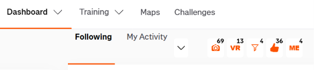

# Strava Feed Filters

Tampermonkey userscript for Strava that filters the feed by activity type and hides posts without photos or videos, virtual activities, posts you already liked, and your own posts. Adds a Following / My Activity toggle.

## Controls

- **Following / My Activity** tabs: quick feed-type switch (replaces the native dropdown for the two common feeds)
- `▾` next to the tabs: reveals Strava's original dropdown for clubs and other feed sources
- Camera: hides posts without photos or videos
- `VR`: hides virtual activities
- Funnel: opens the activity-type menu; checked types remain visible and unchecked types are hidden
- Heart: hides posts you already liked
- `ME`: hides your own posts

Orange is on; badges show hidden counts. Activity-type choices are saved in the browser and newly encountered types are enabled by default. The "already liked" and "your own" filters are automatically suppressed on the My Activity feed (where they would hide everything).

## Installation

Install the browser extension:

- [Chrome Web Store](https://chromewebstore.google.com/detail/strava-feed-filters/jdefobolefeekjbgaclabbcffmebamdo)
- [Firefox Add-ons](https://addons.mozilla.org/en-US/firefox/addon/strava-feed-filters/)

Or install the Tampermonkey userscript:

1. Install [Tampermonkey](https://www.tampermonkey.net/)
2. Install the script: [**Strava Feed Filters**](https://raw.githubusercontent.com/rrokot/strava-hide-posts-without-photos/main/strava-photo-filter-toggle.user.js)

Author: [rrokot](https://www.strava.com/athletes/5931245)

## License

MIT License
